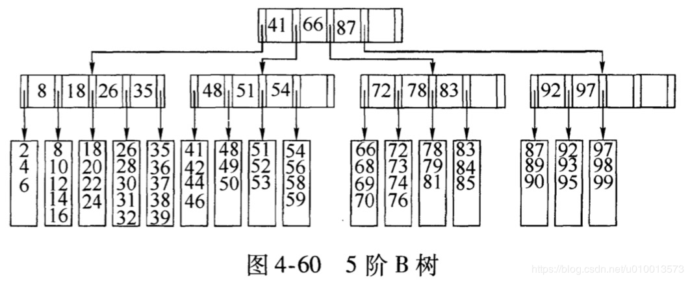

# Index Trees

## B-Tree
It's a m-way search tree, i.e., each node has m-1 keys and m children. It's a
search tree, so all keys in a node is sorted and all children are sorted as 
well. m is called the degree of the m-way tree. For example, here is a 5-way 
B-tree.

Also, each node has a pointer to the data location. 

B-Tree is built from bottom up with the following rules:
- Each non leaf node, except root, must have at least ⌈m/2⌉ children, this is to control 
  the height of the tree. This means that each node, except root, must have at
  least ⎣m/2⎦ or ⌈m/2⌉ - 1 keys, whichever is smaller.
- Root has at least 2 children(and up to m). So root can have 1 key. 
- All leaves are at the same level, so the tree is balanced

### Insertion

[YouTube Demo](https://www.youtube.com/watch?v=aZjYr87r1b8) and [Another](https://www.youtube.com/watch?v=aNU9XYYCHu8&t=578s)

To insert a key, use SEARCh to find the proper **leaf** node to insert,
insert the key and check the number of keys:
- if it's ≤ m-1, we are done
- if it's > m-1, then we need to split to 3 parts: 
  - left (m-1) / 2 keys, (this is left biased, comparing to right biased)
  - middle single key at postion 1 + (m-1) / 2
  - right rest keys  
The middle key will be pushed to the parent. If the parent gets crowded,
then we repeat the same process to split the parent too, and so on.  

### Deletion

[YouTube Demo](https://www.youtube.com/watch?v=GKa_t7fF8o0)

To delete a key, use SEARCh to find the proper node to delete:
- if the node is a leaf node and has ⌈m/2⌉ - 1 keys after delete, then we are done.
- if the node is a leaf node and less than min number of keys:
  - if we can borrow from left/right siblings, we can bring down parent and push
    their max to the parent
  - otherwise, we merge the sibling(left of right), parent, and current. If the
    new parent doesn't have min keys, then we repeat the same process to parent.
- if the node is not a leaf node:
  - if predecessor node has min keys after deletion, replace target with predecessor
    and delete predecessor.
  - if successor can serve the purpose, do it.
  - if both can't do it, merge left child, target, right child and delete the target.  

### Traversal

### Coding steps

https://www.programiz.com/dsa/b-tree
https://cstack.github.io/db_tutorial/
https://www.cpp.edu/~ftang/courses/CS241/notes/b-tree.htm

### Extension

- Allow duplicated keys

## B+ Tree

The difference between B tree and B+ tree are the following:
- no data pointer from non leaf node.
- all non leaf nodes are copied to leaf nodes.
- all leaf nodes have pointers to data
- all leaf nodes are connected in linked list fashion.
